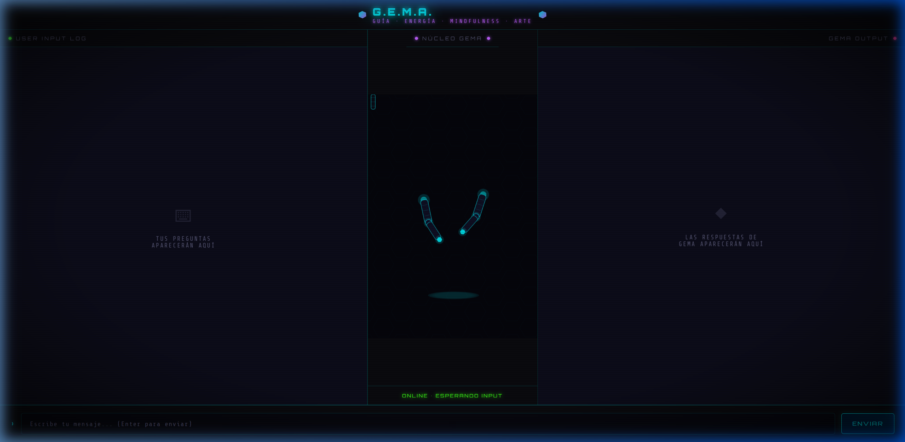

# GEMA: Tu Asistente de Enfoque Artístico (Local & Privado)

Este proyecto es una herramienta diseñada para ayudar a creadores y artistas a mantenerse enfocados en sus proyectos creativos. Utiliza un modelo de lenguaje **Gemma 3 (4B)** de Google ejecutado localmente a través de **LMStudio**, lo que permite tener un asistente inteligente personalizado ("una GEM de Gemini") sin costes de tokens, de forma privada y sin depender de servidores externos.

## 🚀 Propósito del Proyecto

GEMA ha sido programada por **Carles Gutiérrez** en copilotaje con **Gemini 3** en el entorno **Antigravity**.

Su misión principal es:
- **Guiar a artistas:** Ofrecer consejos basados en mindfulness y coaching creativo.
- **Evitar distracciones:** Detectar cuando el usuario intenta evadirse hablando de redes sociales, series o películas, y redirigirlo amablemente hacia su trabajo artístico.
- **Ejemplo didáctico:** Mostrar cómo integrar un LLM local en una aplicación web sencilla (HTML/JS/CSS) de forma rápida y efectiva.



---

## 🎨 Animaciones con p5.js (Núcleo GEMA)

La parte visual central del proyecto está desarrollada con la librería **p5.js**. No son simples vídeos, sino un sistema de animación procedimental que reacciona al estado de la IA.

### Funciones Principales de Animación

En el archivo `robot.js` se definen las lógicas que dan vida a los brazos y partículas de GEMA:

*   **`drawArms(p, t, thinkT, isThinking)`**: Esta función calcula la posición de los brazos. 
    *   Usa cinemática inversa simplificada y ángulos de rotación (`upperArmAngle`, `forearmAngle`).
    *   **En reposo (Idle)**: Los brazos se mueven suavemente usando `Math.sin(t)` para simular una "respiración".
    *   **Pensando (Thinking)**: Los ángulos cambian mediante un `lerp` (interpolación lineal) para elevar los brazos hacia la cabeza, añadiendo un pequeño temblor aleatorio.
*   **`drawThinkingParticles(p)`**: Gestiona el sistema de partículas que emanan de la cabeza cuando la IA procesa una respuesta.
    *   Cada partícula tiene propiedades de velocidad (`vx`, `vy`), vida (`life`) y color.
    *   Se actualizan en cada frame y se "re-generan" (respawn) cuando su vida llega a cero, creando un bucle infinito de energía cian y púrpura.
*   **`drawHead()` y `eyeBlink`**: La cabeza incluye una lógica de parpadeo aleatorio (`blinkTimer`) y pupilas que siguen un movimiento errático cuando GEMA está "concentrada".

## 🛠️ Cómo se construyó (Evolución)

Este proyecto nació de una idea simple: **¿Cómo puedo hablar con una IA profesional desde mi propia web sin pagar suscripciones?**

### Paso 1: La Demo Básica
Primero, le pedí a un LLM que creara una demo mínima para probar la conexión con LM Studio. Este fue el código inicial:

```html
<!-- Ejemplo de la base tecnológica inicial -->
<script>
    async function enviar() {
        const response = await fetch("http://localhost:1234/v1/chat/completions", {
            method: "POST",
            headers: { "Content-Type": "application/json" },
            body: JSON.stringify({
                messages: [{ role: "user", content: pregunta }],
                temperature: 0.7
            })
        });
        const data = await response.json();
        resDiv.innerText = data.choices[0].message.content;
    }
</script>
```

### Paso 2: Personalización y "System Prompt"
Una vez que la conexión funcionaba, el reto era convertir una IA genérica en **GEMA**, una coach experta. Esto se logra mediante el **System Prompt** que se encuentra en el archivo `config.txt`.

#### ¿Cómo definimos su comportamiento?
En `config.txt` hemos programado las "reglas de oro" de GEMA:
1.  **Identidad**: Se presenta como una asistente mindfulness para artistas.
2.  **Redirección de Distracciones**: Si el usuario menciona series, películas o redes sociales, GEMA está instruida para:
    *   Reconocer el deseo del usuario (empatía).
    *   Redirigir suavemente hacia la tarea artística ("¿Y si avanzamos 15 minutos antes de ese descanso?").
3.  **Técnicas incorporadas**: Tiene permiso para sugerir técnicas Pomodoro, visualizaciones o ejercicios de respiración rápidos.

Este archivo `config.txt` se carga dinámicamente al iniciar la web (`app.js`), permitiendo que el modelo **Gemma 3** sepa exactamente qué papel debe jugar sin necesidad de re-programar nada.

---

## 🚀 Requisitos Previos (LM Studio)

Para poner en marcha este proyecto, necesitas preparar tu entorno local siguiendo estos pasos:

1.  **Descargar LM Studio:** Es la herramienta de escritorio que permite cargar y servir modelos de IA localmente. Puedes bajarlo en [lmstudio.ai](https://lmstudio.ai/).
2.  **Descargar el Modelo:** Dentro de LM Studio, busca y descarga el modelo `Gemma 3 4B` (o una variante similar que soporte tu equipo).
3.  **Seleccionar el Modelo:** Ve a la sección de "Chat" (icono del invasor/robot) y selecciona el modelo para que se active en memoria.
4.  **Iniciar el Servidor Local:**
    - Dirígete a la sección de **Developer** (icono de consola `<>`).
    - Haz clic en **Start Server**.
    - Asegúrate de que el estado sea **"Running"** y que la dirección sea `http://127.0.0.1:1234`.

---

## 💻 Instalación y Uso

Una vez que LM Studio está sirviendo el modelo, sigue estos pasos para lanzar la interfaz web:

1.  **Clona o descarga** este repositorio en tu ordenador.
2.  **Configura el prompt (opcional):** El archivo `config.txt` contiene las instrucciones de personalidad de GEMA. Puedes editarlo para que se adapte mejor a tus necesidades.
3.  **Abre el terminal** en la carpeta del proyecto.
4.  **Lanza un servidor web local:** Puedes usar `npx serve` para previsualizar la web correctamente:
    ```bash
    npx serve
    ```
5.  **¡Interactúa!** Abre la dirección que te indique el terminal (normalmente `http://localhost:3000`) y empieza a chatear con GEMA.

---

## 🎨 Estética y Funcionalidad

La herramienta cuenta con una interfaz con estética **Cyberpunk/Gamer**:
- **Robot Animado:** Una animación central hecha en p5.js que reacciona cuando GEMA está pensando o hablando.
- **Historial de Chat:** Dividido en mensajes de usuario (izquierda) y respuestas del bot (derecha).
- **Personalidad GEMA:** Configurada para ser empática pero firme con tus objetivos creativos.

---

## 📄 Licencia

Desarrollado con fines didácticos por Carles Gutiérrez. Siente libre de usarlo, modificarlo y aprender de cómo conectar la IA local con la web.
